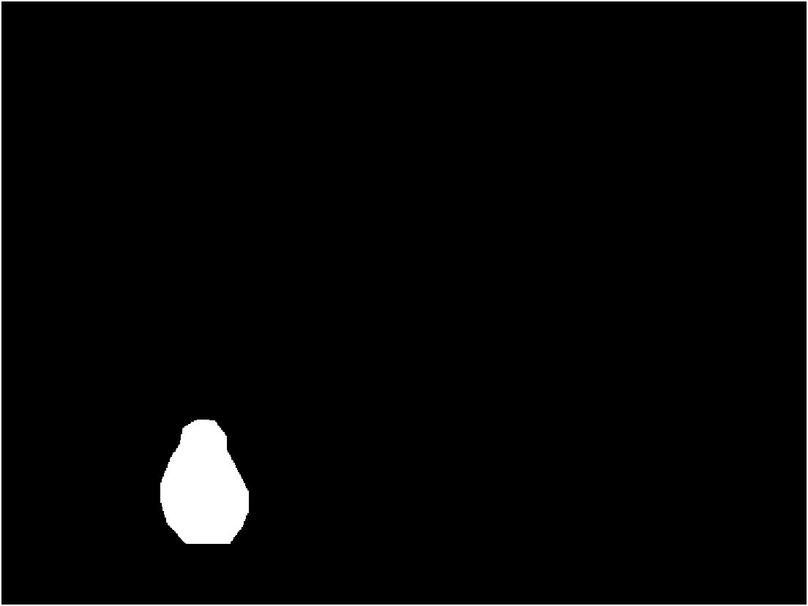
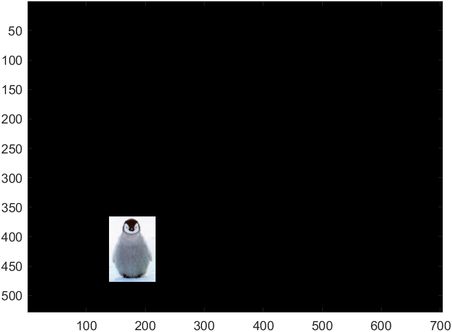
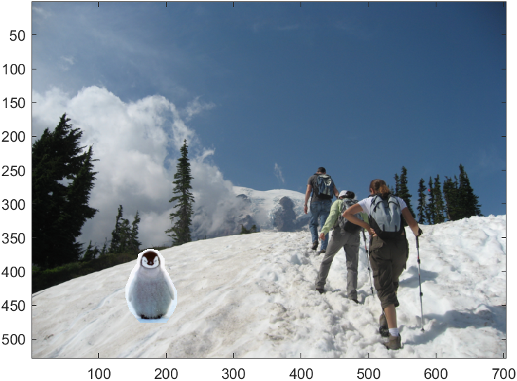
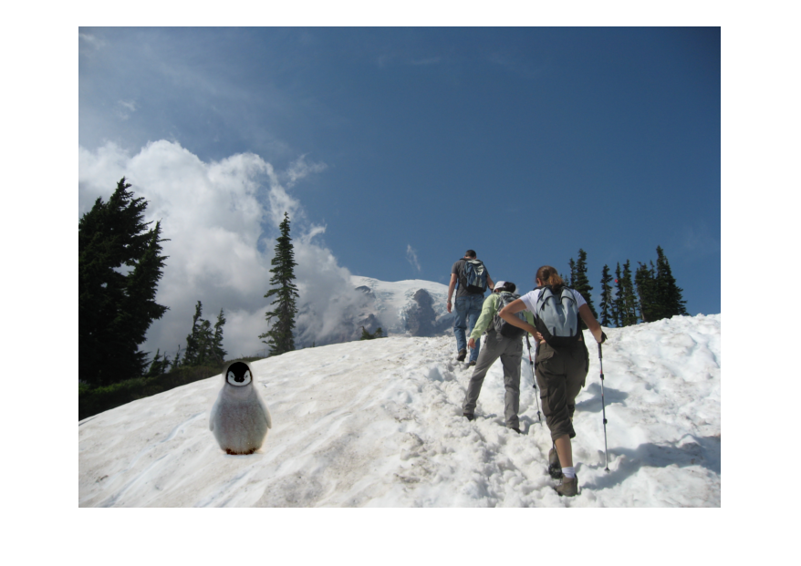
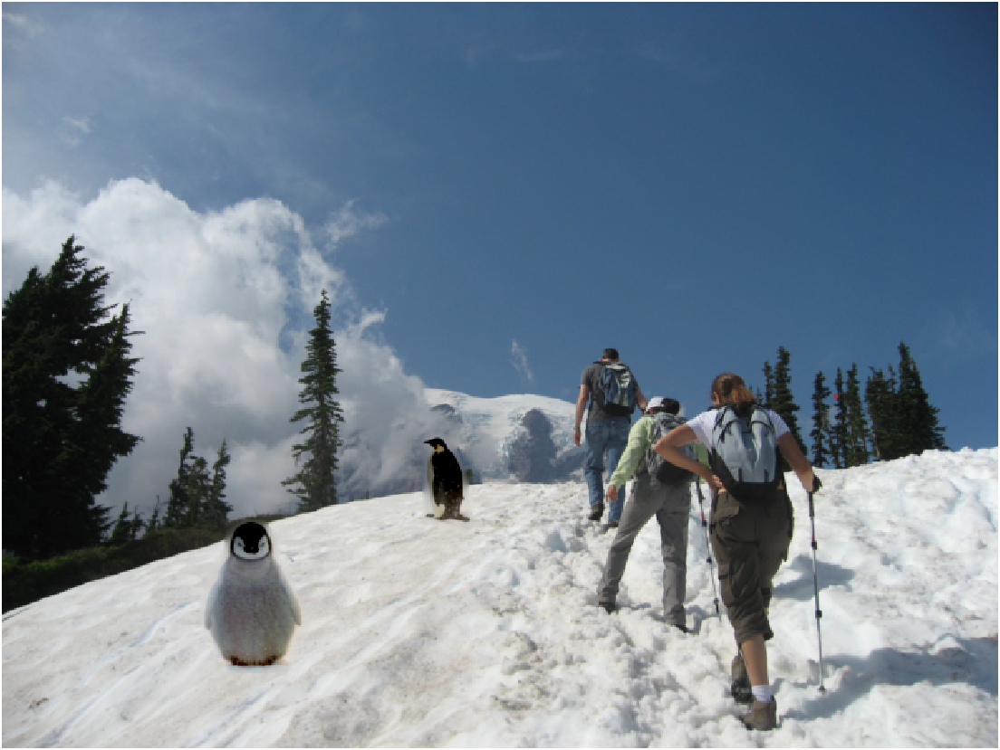
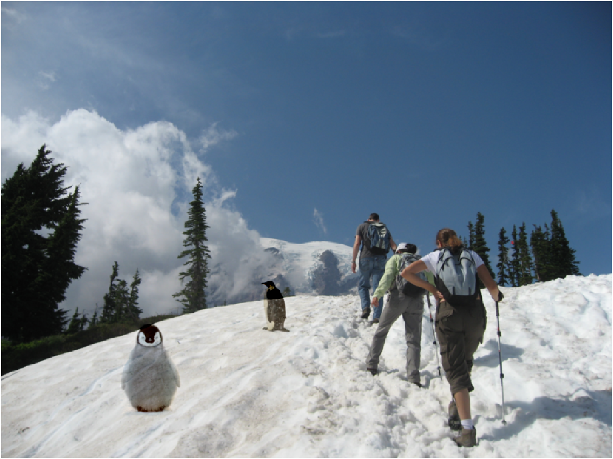
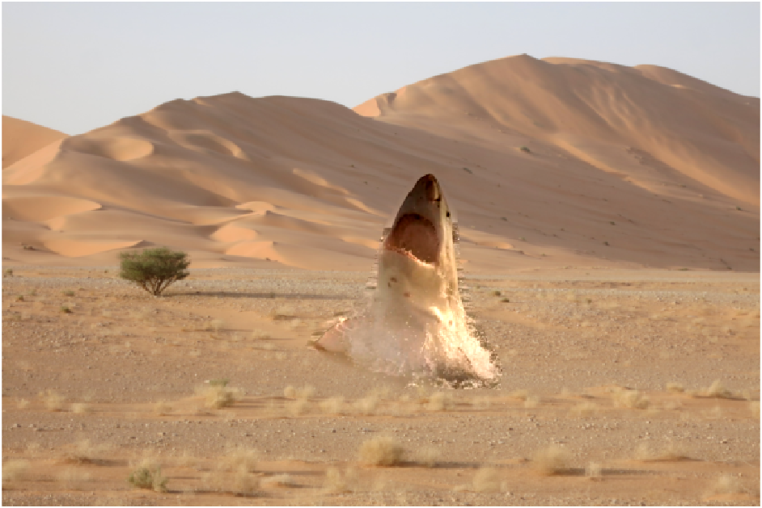
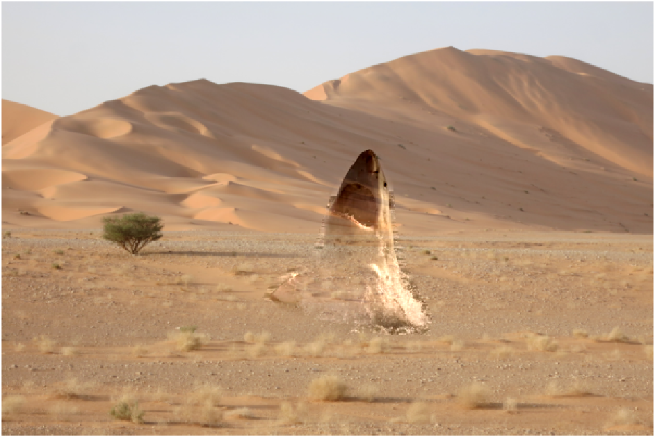

# Poisson Blending

## Toy Problem

In this section, the image "toy_problem.png" will be reconstructed by matching x and y gradients and one pixel.  
The pixels are mapped to variable using the variable `im2var`.
As recommended in the assignment sheet, `sparse` funciton is used to initialize large variable 

```matlab
toy_img = imread('data/toy_problem.png');
toy_double = im2double(toy_img);

[H, W, C] = size(toy_img);

im2var = zeros(H, W);
im2var(1:H*W) = 1:H*W;

A = sparse((H-1)*W+(W-1)*H, H * W);
b = zeros(H*W, C);
e = 1;
```

After initializing the variables, the difference between the x-gradients of v and the x-gradients of s is calculated
```matlab
for y=1:H
    for x=1:W-1
        A(e, im2var(y, x+1)) = 1;
        A(e, im2var(y, x)) = -1;
        b(e) = toy_double(y, x+1) - toy_double(y, x);
        e = e + 1;
    end
end
```

Using the same method the difference between the y-gradients of v and the x-gradients of s is calculated
```matlab
for x=1:W
    for y=1:H-1
        A(e, im2var(y+1, x)) = 1;
        A(e, im2var(y, x)) = -1;
        b(e) = toy_double(y+1, x) - toy_double(y, x);
        e = e + 1;
    end
end
```

We use `lscov` function to solve least square problem to obtain `v`. 
Once `v` is computed, `v` is reshaped as an reconstructed image.
```matlab
A(e, im2var(1,1)) = 1;
b(e) = toy_double(1,1);

v = lscov(A, b);
toy_recon = reshape(v, [H, W]);

figure;
imshow(toy_recon);
```


## Poisson Blending

In this section, two penguin images will be blended into hiking image. 
Images are first resized to small size in order to fasten the process of blending

```matlab
hiking_img = imread('./data/hiking.jpg');
penguin1_img = imread('./data/penguin-chick.jpeg');
penguin2_img = imread('./data/penguin.jpg');

hiking_double = im2double(hiking_img);
penguin1_double = im2double(penguin1_img);
penguin2_double = im2double(penguin2_img);

hiking_resized = imresize(hiking_double, 0.25, 'bilinear');
penguin1_resized = imresize(penguin1_double, 0.25, 'bilinear');
penguin2_resized = imresize(penguin2_double, 0.25, 'bilinear');
```

Using the `getMask()` function, we select the boundaries of a region in the penguin image and obtain mask of the selected region.
```matlab
penguin1_mask = getMask(penguin1_resized);
penguin2_mask = getMask(penguin2_resized);
```

Using the `alignSource` function, masked penguin image is placed on the hiking image by selecting the desired location. 
```matlab
[source1, mask1] = alignSource(penguin1_resized, penguin1_mask, hiking_resized);
image_blended1 = Poisson_Blending(source1, mask1, hiking_resized);

[source2, mask2] = alignSource(penguin2_resized, penguin2_mask, image_blended1);
image_blended2 = Poisson_Blending(source2, mask2, image_blended1);
```





Poisson blending follows the same initialization of variables and reconstruction of image as the `Toy_Problem`. The only difference is that the filtering is applied to blend two different image based on their gradient difference. 
```matlab
for y=1:H
        for x=1:W
            if mask(y, x) == 1
                A(e, im2var(y, x)) = 4;
                A(e, im2var(y-1, x)) = -1;
                A(e, im2var(y+1, x)) = -1;
                A(e, im2var(y, x-1)) = -1;
                A(e, im2var(y, x+1)) = -1;
                b(e, :) = 4 * source(y, x, :) - source(y-1, x, :) - source(y+1, x, :) - source(y, x-1, :) - source(y, x+1, :);
            else
                A(e, im2var(y, x)) = 1;
                b(e, :) = target(y, x, :);
            end
            e = e + 1;
        end
    end
```



## Mixed Gradient Blending

While Poisson blending solely based on the gradient of a source, the Mixed Gradient blending chooses either source's or target's gradient difference. The gradient with the largest magnitude will be choosed. Hence, for all direction, the magnitudes of gradient difference is compared to choose one of them. After. `A` and `b` are computed, the image is reconstructed using the same method as the Poisson blending. 
```matlab
for y=1:H
        for x=1:W
            if mask(y, x) == 1
                A(e, im2var(y, x)) = 4;
                A(e, im2var(y-1, x)) = -1;
                A(e, im2var(y+1, x)) = -1;
                A(e, im2var(y, x-1)) = -1;
                A(e, im2var(y, x+1)) = -1;
                
                d1 = 0;
                d2 = 0;
                d3 = 0;
                d4 = 0;
                
                grad_s = source(y, x, :) - source(y-1, x, :);
                grad_t = target(y, x, :) - target(y-1, x, :);
                if abs(grad_s) > abs(grad_t)
                    d1 = grad_s;
                else
                    d1 = grad_t;
                end
                
                grad_s = source(y, x, :) - source(y+1, x, :);
                grad_t = target(y, x, :) - target(y+1, x, :);
                if abs(grad_s) > abs(grad_t)
                    d2 = grad_s;
                else
                    d2 = grad_t;
                end
                
                grad_s = source(y, x, :) - source(y, x-1, :);
                grad_t = target(y, x, :) - target(y, x-1, :);
                if abs(grad_s) > abs(grad_t)
                    d3 = grad_s;
                else
                    d3 = grad_t;
                end
                
                grad_s = source(y, x, :) - source(y, x+1, :);
                grad_t = target(y, x, :) - target(y, x+1, :);
                if abs(grad_s) > abs(grad_t)
                    d4 = grad_s;
                else
                    d4 = grad_t;
                end
                
                b(e, :) = d1 + d2 + d3 + d4;
            else
                A(e, im2var(y, x)) = 1;
                b(e, :) = target(y, x, :);
            end
            e = e + 1;
        end
    end
```

## My Own



